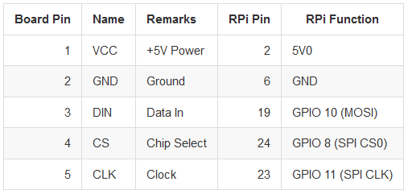

# Near Field Groovinator

Fast and easy groove creation

## Arduino racket
We are using an Arduino NANO with the bluetooth HC05 and an NFC Shield as a racket. 
The racket can read notes from RFID chips and send them via bluetooth to the Raspberry Pi. 

You also have two buttons to switch between thh current channel which represents a tone layer (eg. Kick, Snare, HiHat).

## Raspberry Pi 3 - Sequencer, Bluetooth receiver & Displayer
The Raspberry Pi receives signals from the Arduino and starts a Sequencer. 
It will add notes to different channels and start playing them sequentially.

With some hardware knobs and buttons you can control the sequencer and record your notes.

### Displayer
For visual support we will use an already existing LED matrix (16 x MAX7219). 
It will show the programmed sequence and give additional information.

### Hardware-Setup

General Overview of Pins on the Raspberry Pi 3:


For buttons and the rotary encoder use this table to connect:

| Rotary Encoder | Pins       | GPIO       |
|----------------|------------|------------|
| beat_changer   | 11, 13, 15 | 17, 27, 22 |
| bpm_changer    | 12, 16, 18 | 18, 23, 24 |
| volume_changer | 29, 31, 32 | 5, 6, 13   |
| Buttons        |            |            |
| play_button    | 36         | 16         |
| reset_button   | 38         | 20         |
| metro_button   | 40         | 21         |
| record_button  | 26         |  7         |

For the Displayer connect your pins from the MAX7219 Matrix to the raspberry according to the following image:




### Install packages on RasPi:
```
sudo apt-get update

# get Bluetooth setup
sudo apt-get install bluetooth bluez pi-bluetooth blueman

# install python3 and pip3
# follow this tutorial: http://www.knight-of-pi.org/installing-python3-6-on-a-raspberry-pi/

# open spi device port
sudo nano /boot/config.txt
# enable code line: 'dtparam=spi=on'
# reboot
```

To establish a connection between the RasPi and Arduino (via Bluetooth module HC05) execute the following commands on RasPi:
```
# find out macAdress of hc05 or additionally execute 'scan on' in bluetoothctl to find devices
# pair with hc05
sudo bluetoothctl
    agent on
    default-agent
    pair $macAdress
    trust $macAdress
    exit
```

First edit the script ```./start_sequencer.sh``` and change the MAC address to your HC05 value.
Then start it to open the serial port, listen for bluetooth signals and start the sequencer:

```
./start_sequencer.sh
```

If you cant hear anything make sure you are using the right audiosource. With this command you can set your audio output in the Raspberry Pi:

```
# Value: 0 - auto, 1 - analoque (headphone jack), 2 - HDMI
sudo amixer cset numid=3 <value>
```

At some point for whatever reason we could not get the audio anymore from the headphone jack. With an external USB soundcard it was still working. For that you can use these commands:
```
# find the name of your card:
lsusb
# create a configuration file and put the these values with your card number:
sudo nano /etc/asound.conf
	pcm.!default {
	    type hw
	    card 1
	}
	 
	ctl.!default {
	    type hw           
	    card 1
	}
# after that reboot and try sound again:
sudo reboot
# you can also use the builtin mixer:
alsamixer
```